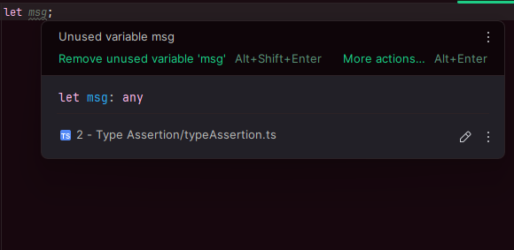
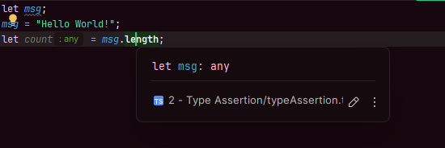
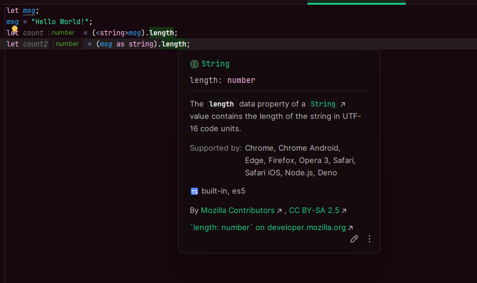

# Type Assertion

---

TypeScript'te değişken tanımlarken bazen primitive (ilkel) tipini belirtmeyi unutabiliriz. Bu durumda, o değişken ile işlem yapmaya çalıştığımızda sorunlarla karşılaşabiliriz.

Örneğin, yukarıdaki örnekte `msg` adında bir değişken tanımladım fakat tip belirlemesi yapmadım. Bu durumda TypeScript, değişkenin tipini `any` olarak varsayar. Bu değişkene string türünde bir değer atayıp length özelliğini kullanmaya çalıştığımızda sorun yaşarız.

Görselde görüldüğü gibi, TypeScript `msg` değişkeninin string türünde olduğunu anlayamadı. Bu sorunu çözmek için type assertion (tip belirtme) kullanmamız gerekiyor.

Type assertion için iki farklı yöntem bulunmaktadır:
1. Açık tip belirtme: `<string>value`
2. "as" keyword kullanımı: `value as string`

Her iki yöntem de aynı dönüştürme işlemini gerçekleştirir. Hangi yöntemi kullanacağınız tercihinize bağlıdır. Modern TypeScript projelerinde genellikle `as` keyword'ü daha yaygın olarak kullanılmaktadır.